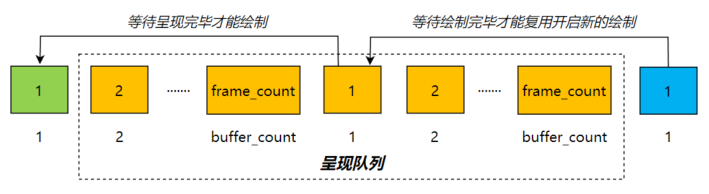
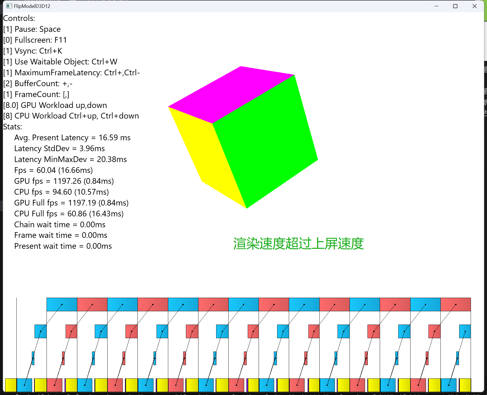
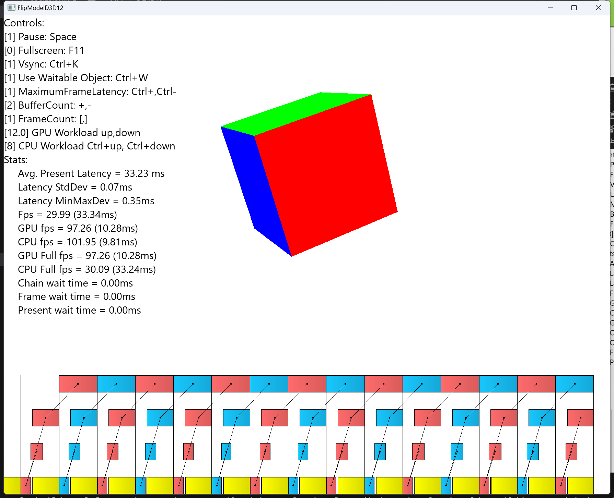
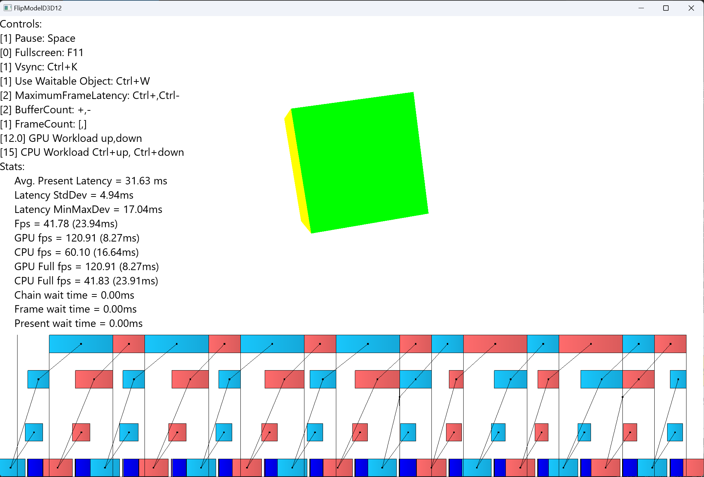
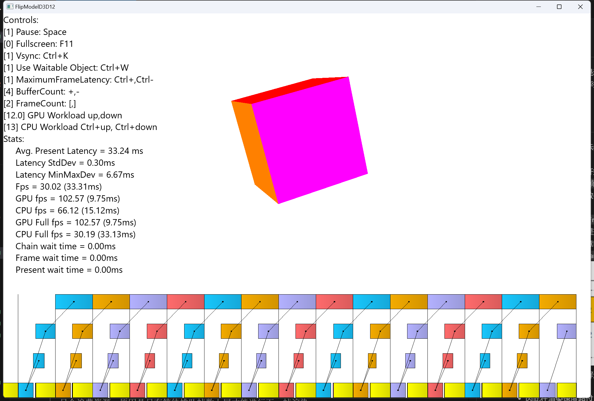
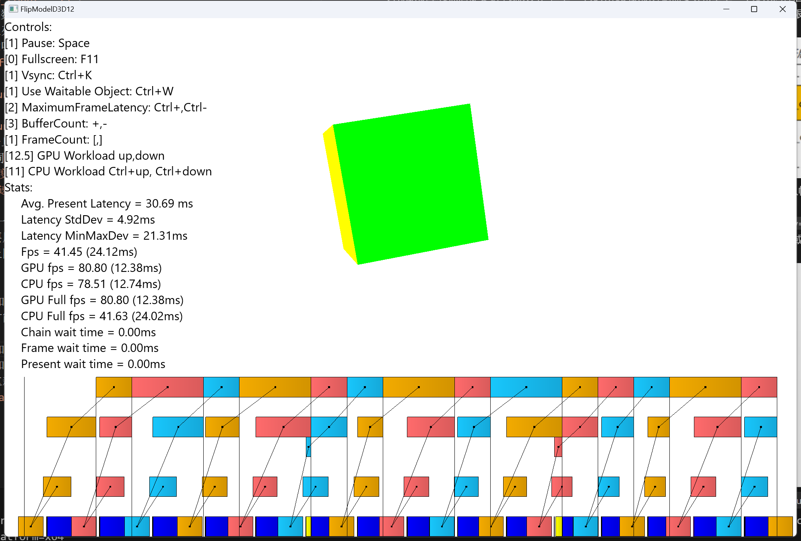
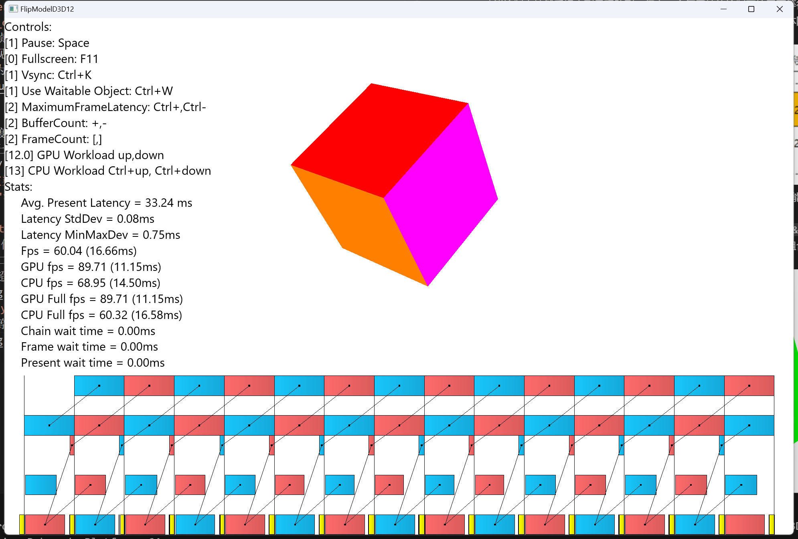
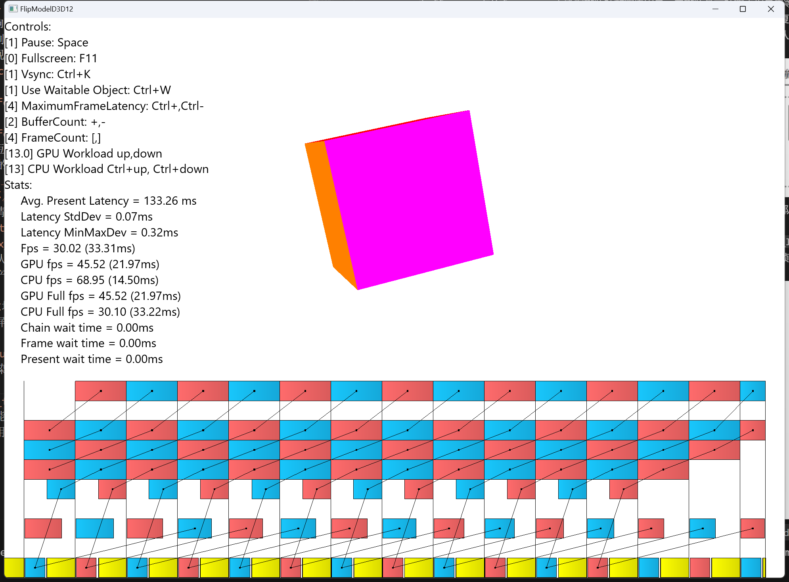
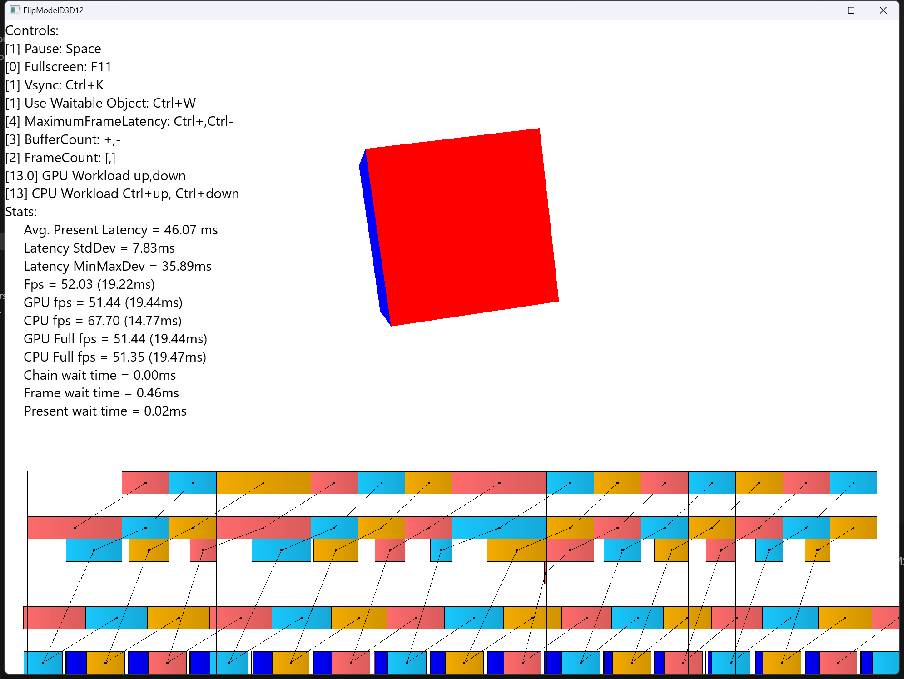

## 两个重要指标：
- 渲染帧率：反应的是动画流畅性，是否有卡顿等表现
- 上屏时延：渲染完毕投递到呈现队列到最终屏幕呈现的时间间隔=呈现队列排队帧数*每帧上屏渲染时长，反应的是用户反馈的及时性
## 几个重要结论：
- 最佳渲染帧率为显示器的刷新率，就是所谓帧同步，超过刷新率要么浪费资源出现大量帧的丢弃，要么排队增加上屏时延；
- 在每个帧同步间隔开始渲染，在一个帧同步周期内完成一帧渲染，是最佳状态，稳定流畅且上屏时延最低；
- `呈现队列最大排队帧数`由交换链最大排队帧数(`max_frame_latency`)，后台缓冲区个数(`buffer_count`)及gpu绘制队列最大排队帧数(`frame_count`)共同决定，等于`min(max_frame_latency, buffer_count + frame_count - 1)`；
- `buffer_count`及`frame_count`影响排队帧数的原因是，要排队当前帧的流程是先等待上一个复用帧的绘制完成，才能绘制本帧然后提交到呈现队列，但上一个复用帧的绘制开始需要等待上上一个复用同样后台缓冲区的帧上屏呈现完成，呈现完毕意味着会从呈现队列移除一帧继续呈现，这样就整体限制了呈现队列的上限，如下图为`buffer_count=frame_count`情况的示意图，其他情况以此类推：

- 在渲染速度超过上屏速度时，增加`buffer_count`或`frame_count`可能会增加呈现队列排队帧数，进而增加上屏时延；
- 因此在渲染速度超过上屏速度时，`buffer_count=2&frame_count=1&max_frame_latency=1`是最佳组合，帧率同步刷新率且上屏时延最短，但一旦渲染速度不及上屏速度时，这种组合就会导致帧率折半或更低（帧率 = 刷新率 / 渲染占用的垂直同步间隔数）；

- 在渲染速度不及上屏速度时，几个实验情况：
  - 保持`buffer_count=2&frame_count=1`，增加`max_frame_latency`到`2`, 有一定程度的帧率提升（1/3左右），再进一步增加`max_frame_latency`没有作用， 提升的主要原因是排队与渲染的并行性，也就是队列里有一帧在排队时，可以并行进行第二帧的渲染，但有上限的原因是，渲染速度低于上屏速度，队列消费快于生产，导致队列长度不会超过`2`;
  
  - 保持`max_frame_latency=1`，任意增加`buffer_count`或`frame_count`均无济于事，只会浪费资源，原因是只有等待排队帧数上屏才能在下一个垂直同步时刻开始进行下一帧渲染；
  
  - 保持`frame_count=1`，任意增加`buffer_count`或`max_frame_latency`均无济于事，根本原因是不增加`frame_count`没有让渲染在cpu及gpu之间并行起来；
  
  - 保持`buffer_count=2`，增加`max_frame_latency`到`2`，同时增加`frame_count`到`2`, 在渲染整体占用两个垂直同步周期时，能将帧率重新提升到刷新率，原因是渲染在cpu与gpu间形成了一定的流水线并行性，但渲染整体占用超过两个垂直同步周期时，帧率会再次折半，继续增加`frame_count`或`max_frame_latency`不起作用；
  
  
  - 保持`buffer_count=3&max_frame_latency=4&frame_count=2`对于渲染整体占用超过两个垂直同步周期时，能最大限度的提升帧率不足，再进一步增加只会浪费资源，增加时延，没有作用；
  
- 因此在渲染速度不及上屏速度时，几个初步结论：
  - 渲染整体时间在两个垂直同步周期内时，最佳组合是`buffer_count=2&max_frame_latency=2&frame_count=2`；
  - 渲染整体时间超过两个垂直同步周期时，最佳组合是`buffer_count=3&max_frame_latency=4&frame_count=2`;
- 实际开发中综合考虑帧率及时延，最佳组合推荐`buffer_count=3&max_frame_latency=2&frame_count=2`;
## 延展思考：
- 在2D的GUI组件框架中，界面一般不需要每帧都更新，所以一般会采用被动模式设计，需要更新时告知框架，框架在下一个垂直同步间隔包装后台缓冲区为一个画布作为参数，然后回调每个组件的绘制接口，在一个垂直同步间隔内完成绘制，然后在下一个间隔翻转缓冲区上屏显示；
- 在3D的游戏应用中，本质类似互动式视频，每一帧都在变化，所以一般会采用主动模式设计，会有一个游戏循环，周期性（基于帧率设置）获取后台缓存区绘制并投递上屏；