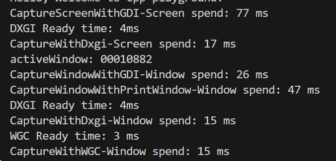

## 基本结论
- win平台有4种截屏（窗口）方式，分别是GDI、PrintWindow、DXGI及WGC;
- DXGI及WGC(Window Graphics Capture)方式有初始化成本，初始化后获取单帧非常快，使用相对复杂，更适合连续高性能抓取屏幕（窗口）帧流场景;
- DXGI只能获取整个屏幕帧，WGC可以同时支持指定窗口，两者对操作系统版本都有要求，DXGI需要win8+, WGC需要win10+;
- WGC截取窗口时，窗口不能处于最小化状态，否则获取不到帧;
- 普通的静态截屏应用适合用GDI方式，有最好的系统兼容性，但无法截取硬件加速窗口;
- PrintWindow也适合普通的静态截屏场景，使用简单，win8开始支持截取硬件加速窗口;

  