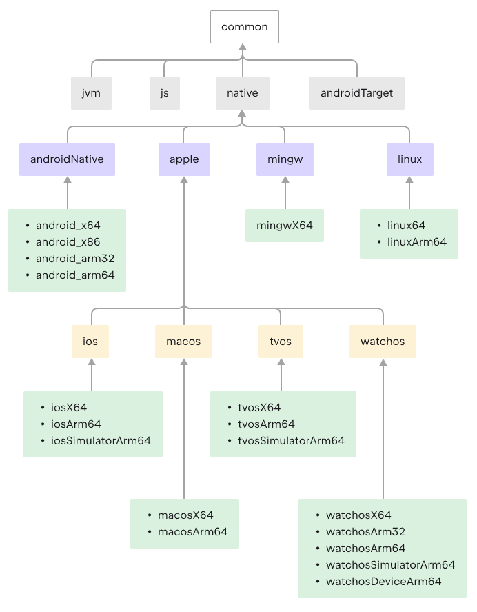

# Kotlin Multiplatform Playground

- 多平台开发基础文档：https://book.kotlincn.net/text/d-multiplatform.html
- 多平台应用开发文档：https://www.jetbrains.com/help/kotlin-multiplatform-dev/multiplatform-create-first-app.html
### 基本概念
- **多平台**：平台有多个层级维度，基于构建后的目标代码类型，执行机器类型，操作系统类型等区分，理论上有如下树状的结构，特定平台就是树根到叶子的一个路径组合，Kotlin目前可能是支持平台最全的编程语言，多数native语言（C/C++/Rust/Go/Swift等）也就支持native+wasm，donnet可以支持clr+native+wasm，当前native各平台支持情况参见：https://book.kotlincn.net/text/native-target-support.html;
```
├── jvm
│   ├── android
│   └── common
├── native
│   ├── x86/x64
│   │   ├── macos/ios(Tier1支持，不支持x86)
│   │   ├── watchos/tvos(Tier2支持，不支持x86)
│   │   ├── windows(Win7+，基于MinGW，Tier3支持，不支持x86)
│   │   ├── linux(Tier2支持，不支持x86)
│   │   └── androidNative(Tier3支持)
│   └── arm32/arm64
│       ├── macos/ios(Tier1支持，不支持arm32)
│       ├── watchos/tvos(Tier2支持，tvos不支持arm32)
│       ├── windows(不支持)
│       ├── linux(Tier2支持，不支持arm32)
│       └── androidNative(Tier3支持)
├── js
│   ├── browser
│   └── node
└── wasm
  ├── browser
  ├── node
  └── wasi(WebAssembly System Interface)
```
- **构建目标(Target)**：定义了构建平台，各类配置，及源码集合等，平台可以设置多个不同配置的构建目标，一个构建目标里可以配置不同类型的构建产物（可执行程序，动态库等），系统提供了[`target presets`](https://book.kotlincn.net/text/multiplatform-dsl-reference.html#%E7%9B%AE%E6%A0%87)来支持不同平台的构建;
- **源码集(Source sets)**：构成不同构建目标的代码集合（物理形态上就是项目里的源码目录），不同的源码集逻辑上会打上构建目标标签（可以多个），自动参与到相应的目标构建中，系统基于构建目标定义会预设好一些源码集，源码集之间可以基于`DependOn`声明形成依赖关系，系统预设的源码集不需要显式声明，自定义源码集合需要显式声明上下游依赖才能融入源码集的依赖树，从而才能正常参与目标构建，源码集里声明对第三方库的依赖，第三方库里至少有与源码集一致构建目标的源码集，其他不一致源码集不可见，构建系统默认预设的完整层次源码集如下图：
